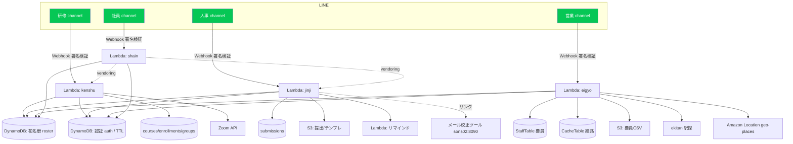

# システム概要書 — BrightStar 統合 LINE アシスタント

版本：v1.0 / 最終更新：2026-06-19

---

## 1. 目的

社内に分散していた複数の LINE 業務アシスタントを **1 つのモノレポ／統一基盤**に集約し、
役割（講師・人事・営業・一般社員）ごとにチャネルを分けつつ、**本人確認・多言語・名簿**などの
共通機能を共有する。これにより運用の一貫性・保守性・セキュリティを高める。

---

## 2. 4 つのチャネル（役割で分離）

| チャネル | 対象 | 主な機能 | バックエンド |
|----------|------|----------|-------------|
| **研修（kenshu）** | 講師 | コース作成・公開(Zoom)・名簿・分組 | Python / CDK |
| **人事（jinji）** | 人事(HR) | 提出状況・催促・一括DL・名簿管理・メール校正 | TypeScript / CDK |
| **営業（eigyo）** | 営業部 | 現場への通勤コスト比較・要員名簿(CSV/単票) | TypeScript / CDK |
| **社員（shain）** | 一般社員 | 研修受講・申込／勤怠・通勤費の提出（統合フロント） | Python / CDK（研修+人事を vendoring） |

> 4 チャネルは **同一 LINE Provider** 配下のため、`userId` がチャネル間で一致する。
> よって 1 つのチャネルで本人確認すれば、本人情報を全チャネルで共有できる。

---

## 3. アーキテクチャ

### 構成のポイント
- 各チャネルは **独立した Lambda（Function URL, authType=NONE）**。入口で **LINE 署名（HMAC-SHA256）** を検証し、正当な LINE 以外を弾く。
- **共有 DynamoDB**：花名册（roster）と認証（auth）は全チャネルで共有。`userId` 共通のため本人情報を一元化。
- **社員チャネル**は研修・人事の「社員側」機能を **vendoring**（`kenshu.*` / `jinji.*` に名前空間分離）して 1 Lambda に同梱。
- **認証(auth) テーブルは TTL** を持ち、当日のみ有効。言語設定も同テーブルに保持。

---

## 4. 共通機能（全チャネル）

| 機能 | 説明 |
|------|------|
| 日次本人確認 | 「所属部署 お名前」で花名册照合 → 役割(role)を判定して通す。2日目以降はワンタップ |
| 専用紐付け | 1 つの社員番号 ＝ 1 つの LINE アカウント（占用ロック）。登録解除で付け替え |
| 多言語 | 日本語／中文を毎日選択（既定：日本語）。キーワードは日英韓中に対応 |
| ヘルプ | 機能とキーワードを **Quick Reply ボタン**で提示（タップで自動送信） |
| Rich Menu | チャネルごとの固定メニュー |

---

## 5. デプロイ構成

| チャネル | スタック / 配置 | 言語 |
|----------|----------------|------|
| 研修 | CDK（Python Lambda）／LINE Webhook + 既存 WeChat 連携 | Python |
| 人事 | `BrightstarHr-dev`（TypeScript CDK） | TypeScript |
| 営業 | `EkiCommute-dev`（TypeScript CDK） | TypeScript |
| 社員 | CDK（Python Lambda、研修+人事を vendoring） | Python |

- **東京リージョン（ap-northeast-1）** に配置。
- **認証情報は SSM SecureString**（コード・環境変数に値を置かない）。
- リポジトリ：`github.com/scgpp12/BrightStar_Line_Sytem`。

---

## 6. セキュリティ方針

- LINE Webhook は **署名検証必須**。Function URL は公開だが署名で保護。
- すべての LINE クレデンシャルは **SSM SecureString**、CDK へは `-c` コンテキストで渡し、ソースに残さない。
- 本人確認は **花名册（在籍者）ベース**。役割でチャネルのアクセスを制御。
- 1 社員番号 ＝ 1 アカウントの**占用ロック**で成りすまし・二重登録を防止。
- 破壊的操作（名簿削除等）は確認・通知を伴う。
