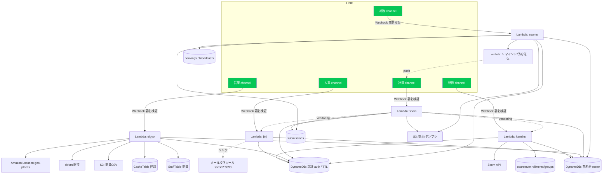

# システム概要書 — BrightStar 統合 LINE アシスタント

版本：v3.0 / 最終更新：2026-09-19
本書の記載は **2026-09-19 時点の実デプロイ（ap-northeast-1 / アカウント 603319838936）を実機照合**した内容です（§7）。

---

## 1. 目的

社内に分散していた複数の LINE 業務アシスタントを **1 つのモノレポ／統一基盤**に集約し、
役割（講師・人事・営業・総務・一般社員）ごとにチャネルを分けつつ、**本人確認・多言語・名簿**などの
共通機能を共有する。これにより運用の一貫性・保守性・セキュリティを高める。

---

## 2. 5 つのチャネル（役割で分離）

| チャネル | 表示名 | 対象 | 主な機能 | バックエンド |
|----------|--------|------|----------|-------------|
| **研修（kenshu）** | BS研修 | 講師 | コース作成・公開(Zoom)・名簿・分組 | Python / CDK |
| **人事（jinji）** | BS人事 | 人事(HR) | 社員名簿の管理・メール校正（提出の受領はしない） | TypeScript / CDK |
| **営業（eigyo）** | BS営業 | 営業部 | 現場への通勤コスト比較・要員名簿(CSV/単票) | TypeScript / CDK |
| **総務（soumu）** | BS総務 | 総務担当 | 提出状況・未提出抽出(CSV)・催促／予約催促／一斉送信・既読確認・削除・一括/個別DL | TypeScript / CDK |
| **社員（shain）** | BS社員管理 | 一般社員 | 研修受講・申込／勤務表・交通費・その他経費の提出（統合フロント） | Python / CDK（研修+人事を vendoring） |

> 5 チャネルは **同一 LINE Provider** 配下のため、`userId` がチャネル間で一致する。
> よって 1 つのチャネルで本人確認すれば、本人情報を全チャネルで共有できる。

> **責務分離（2026-07〜）**：提出の受領は社員チャネル、提出の**管理・催促・回収**は総務チャネル、
> 名簿と採用まわりは人事チャネル、と役割を分けている。

---

## 3. アーキテクチャ


```mermaid
flowchart TB
  subgraph LINE
    K[研修 channel]:::ch
    J[人事 channel]:::ch
    SO[総務 channel]:::ch
    E[営業 channel]:::ch
    S[社員 channel]:::ch
  end

  K -->|Webhook 署名検証| KF[Lambda: kenshu]
  J -->|Webhook 署名検証| JF[Lambda: jinji]
  E -->|Webhook 署名検証| EF[Lambda: eigyo]
  S -->|Webhook 署名検証| SF[Lambda: shain]
  SO -->|Webhook 署名検証| SOF[Lambda: soumu]

  SF -.vendoring.-> KF
  SF -.vendoring.-> JF

  KF & JF & EF & SF & SOF --> ROSTER[(DynamoDB: 花名册 roster)]
  KF & JF & EF & SF & SOF --> AUTH[(DynamoDB: 認証 auth / TTL)]

  KF --> COURSE[(courses/enrollments/groups)]
  KF --> ZOOM[Zoom API]
  SF --> SUB[(submissions)]
  SF --> S3J[S3: 提出/テンプレ]
  SOF --> SUB
  SOF --> S3J
  SOF --> BC[(bookings / broadcasts)]
  SOF --> REM[Lambda: リマインド/予約催促]
  REM -.push.-> S
  JF -.リンク.-> PROOF[メール校正ツール sons02:8090]
  EF --> STAFF[(StaffTable 要員)]
  EF --> CACHE[(CacheTable 経路)]
  EF --> S3E[S3: 要員CSV]
  EF --> EKITAN[ekitan 駅探]
  EF --> GEO[Amazon Location geo-places]

  classDef ch fill:#06C755,color:#fff;
```

### 構成のポイント
- 各チャネルは **独立した Lambda**。入口で **LINE 署名（HMAC-SHA256）** を検証し、正当な LINE 以外を弾く。
  公開方式はチャネルで異なる：**人事／総務／社員／営業は Lambda Function URL（authType=NONE）**、**研修は API Gateway（HTTP API）**（WeChat/企業微信の受信と Web ログインを同一 API にまとめているため）。
- **共有 DynamoDB**：花名册（roster）と認証（auth）は全チャネルで共有。`userId` 共通のため本人情報を一元化。
- **社員チャネル**は研修・人事の「社員側」機能を **vendoring**（`kenshu.*` / `jinji.*` に名前空間分離）して 1 Lambda に同梱。
- **認証(auth) テーブルは TTL** を持ち、当日のみ有効。言語設定も同テーブルに保持。
- **総務チャネル**は社員チャネルと **同じ submissions / S3 バケット**を参照し、回収・催促・削除を行う。催促や一斉送信は**社員チャネルのトークンで push** するため、社員は普段使うチャネルで通知を受け取る。
- 催促・一斉送信には **既読（確認）ボタン**を付与し、`broadcasts` テーブルで確認状況を集計（CSV 出力可）。
- 大きな一覧やファイルは **署名付き短縮 URL**（Function URL の `GET /dl`）経由で配布し、LINE の URL 長制限を回避。実体は S3 の署名付き URL（有効期限1時間）へ 302 リダイレクトする。

---

## 4. 共通機能（全チャネル）

| 機能 | 説明 |
|------|------|
| 日次本人確認 | 「所属部署 お名前」で花名册照合 → 役割(role)を判定して通す。2日目以降はワンタップ |
| 専用紐付け | 1 つの社員番号 ＝ 1 つの LINE アカウント（占用ロック）。登録解除で付け替え |
| 多言語 | 日本語／中文を毎日選択（既定：日本語）。キーワードは日英韓中に対応 |
| ヘルプ | 機能とキーワードを **Quick Reply ボタン**で提示（タップで自動送信） |
| Rich Menu | チャネルごとの固定メニュー |

---

## 5. デプロイ構成

| チャネル | スタック / 配置 | 言語 |
|----------|----------------|------|
| 研修 | CDK（Python Lambda）／LINE Webhook + 既存 WeChat 連携 | Python |
| 人事 | `BrightstarHr-dev`（TypeScript CDK） | TypeScript |
| 営業 | `EkiCommute-dev`（TypeScript CDK） | TypeScript |
| 総務 | `BrightstarSoumu-dev`（TypeScript CDK） | TypeScript |
| 社員 | CDK（Python Lambda、研修+人事を vendoring） | Python |

- **東京リージョン（ap-northeast-1）** に配置。
- **認証情報は SSM SecureString**（コード・環境変数に値を置かない）。
- リポジトリ：`github.com/scgpp12/BrightStar_Line_Sytem`。

---

## 6. セキュリティ方針

- LINE Webhook は **署名検証必須**。Function URL は公開だが署名で保護。
- すべての LINE クレデンシャルは **SSM SecureString**、CDK へは `-c` コンテキストで渡し、ソースに残さない。
- 本人確認は **花名册（在籍者）ベース**。役割でチャネルのアクセスを制御。
- 1 社員番号 ＝ 1 アカウントの**占用ロック**で成りすまし・二重登録を防止。
- 破壊的操作（名簿削除等）は確認・通知を伴う。

---

## 7. 実機構成（2026-09-19 実測）

> 本章は AWS CLI で実環境を照会した結果をそのまま記載する。設計と実機の差異を無くすため、
> 記載を変更する場合は再照会のうえ更新すること。
> リージョン **ap-northeast-1** / アカウント **603319838936**。

### 7-1. CloudFormation スタック

| スタック | 状態 | 最終更新 | 公開エンドポイント |
|----------|------|----------|--------------------|
| `brightstar-kenshu-dev` | UPDATE_COMPLETE | 2026-08-21 | API Gateway `/line`・`/wechat`・`/web/login` |
| `BrightstarHr-dev` | UPDATE_COMPLETE | 2026-08-21 | Lambda Function URL |
| `EkiCommute-dev` | UPDATE_COMPLETE | 2026-07-21 | Function URL ×2（LINE用=NONE／API用=AWS_IAM） |
| `BrightstarSoumu-dev` | UPDATE_COMPLETE | 2026-08-21 | Lambda Function URL |
| `brightstar-shain-dev` | UPDATE_COMPLETE | 2026-08-21 | Lambda Function URL |

### 7-2. Lambda 関数（全11本）

| 関数 | ランタイム | アーキ | メモリ | タイムアウト | 公開 |
|------|-----------|--------|--------|--------------|------|
| `brightstar-kenshu-dev-LineWebhookFunction…` | python3.12 | arm64 | 1024MB | 20s | API GW 経由 |
| `brightstar-kenshu-dev-WebhookFunction…`（WeChat） | python3.12 | arm64 | 1024MB | 20s | API GW 経由 |
| `brightstar-kenshu-dev-WebFunction…`（Webログイン） | python3.12 | arm64 | 1024MB | 20s | API GW 経由 |
| `brightstar-kenshu-dev-ReminderFunction…` | python3.12 | arm64 | 1024MB | 20s | — |
| `brightstar-hr-dev-webhook` | python3.12 | arm64 | 256MB | 29s | Function URL (NONE) |
| `brightstar-hr-dev-reconcile` | python3.12 | arm64 | 256MB | 120s | — |
| `brightstar-soumu-dev-webhook` | python3.12 | arm64 | 512MB | 29s | Function URL (NONE) |
| `brightstar-soumu-dev-reminder` | python3.12 | arm64 | 256MB | 60s | — |
| `brightstar-shain-dev-webhook` | python3.12 | arm64 | 512MB | 29s | Function URL (NONE) |
| `EkiCommute-dev-LineWebhookFn…` | python3.12 | **x86_64** | 256MB | 300s | Function URL (NONE) |
| `EkiCommute-dev-ApiFn…` | python3.12 | **x86_64** | 256MB | 300s | Function URL (**AWS_IAM**) |

> 営業のみ x86_64（requests / BeautifulSoup を含む Layer をビルド済みのため）。
> 他の4チャネルは **実行時の外部ライブラリを持たない**（標準ライブラリ + boto3 のみ）。

### 7-3. DynamoDB（全15テーブル／すべて PAY_PER_REQUEST）

| テーブル | キー | GSI | TTL | 暗号化 | 用途 |
|----------|------|-----|-----|--------|------|
| `brightstar-hr-dev-roster` | `empId` | — | — | KMS(AWS管理) | 社員名簿（全チャネル共有・認証の基点） |
| `brightstar-hr-dev-auth` | `pk` | — | **有効** | KMS(AWS管理) | 日次認証・言語（当日限り） |
| `brightstar-hr-dev-employees` | `userId` | — | — | KMS(AWS管理) | LINE ユーザー ↔ 社員の紐付け状態 |
| `brightstar-hr-dev-submissions` | `userId`+`sk` | GSI1 | — | KMS(AWS管理) | 提出記録（社員が登録・総務が参照/削除） |
| `brightstar-soumu-dev-bookings` | `bookingId` | — | — | KMS(AWS管理) | 催促予約 |
| `brightstar-soumu-dev-broadcasts` | `bcastId` | — | — | KMS(AWS管理) | 配信バッチ・既読(確認)状況 |
| `brightstar-shain-dev-session` | `userId` | — | — | KMS(AWS管理) | 社員チャネルのモード（研修/総務）保持 |
| `brightstar-kenshu-dev-courses` | `courseId` | — | — | KMS(AWS管理) | 研修コース |
| `brightstar-kenshu-dev-enrollments` | `openid`+`courseId` | GSI1 | — | KMS(AWS管理) | 受講申込 |
| `brightstar-kenshu-dev-groups` | `courseId`+`groupId` | — | — | KMS(AWS管理) | 分組 |
| `brightstar-kenshu-dev-students` | `openid` | — | — | KMS(AWS管理) | 受講者 |
| `brightstar-kenshu-dev-results` | `openid`+`itemKey` | GSI1 | — | KMS(AWS管理) | 受講結果 |
| `brightstar-kenshu-dev-knowledge` | `docId`+`chunkId` | — | — | KMS(AWS管理) | RAG 用ナレッジ |
| `EkiCommute-dev-StaffTable…` | `staff_id` | — | — | AWS所有キー | 要員名簿（営業） |
| `EkiCommute-dev-CacheTable…` | `cacheKey` | — | **有効** | AWS所有キー | 経路検索キャッシュ |

### 7-4. S3（`brightstar-hr-dev-603319838936`）

| 設定 | 値 |
|------|-----|
| パブリックアクセス | **4項目すべてブロック** |
| 既定暗号化 | SSE-S3（AES256） |
| バージョニング | **有効**（上書き・削除しても旧版は保持） |
| ライフサイクル | `pending/` 7日削除／`exports/` 3日削除／タグ `lifecycle=managed` の提出物は **60日で Deep Archive・365日で削除** |

格納レイアウト：`hr/{yyyy}/{mm}/{worktimes|expenses|others}/` ＋ `hr/template/`（テンプレ）／`pending/`（一時退避）／`exports/`（ZIP・CSV）。

### 7-5. 定期実行（EventBridge）

| ルール | スケジュール | 内容 |
|--------|--------------|------|
| `brightstar-soumu-dev-reminder-schedule` | `cron(0 0 25,28 * ? *)` | 毎月25日・28日 9:00 JST に未提出者へ自動催促 |
| `brightstar-soumu-dev-booking-poller` | `rate(10 minutes)` | 催促予約の期限到来分を実行 |
| `brightstar-hr-dev-reconcile-schedule` | `cron(0 15 * * ? *)` | 毎日 0:00 JST に LINE 紐付けの到達性を点検 |
| `brightstar-kenshu-dev-ReminderTick…` | `rate(10 minutes)` | 研修開講1時間前リマインド |

### 7-6. 機密情報（SSM Parameter Store）

すべて **SecureString**。値はソース・CDK・本書のいずれにも記載しない。

```
/brightstar-kenshu/dev/line/{secret,token}
/brightstar-hr/dev/line/{secret,token}
/brightstar-soumu/dev/line/{secret,token}
/brightstar-shain/dev/line/{secret,token}
/eki-commute/dev/line/{channel-secret,channel-access-token}
```

---

## 8. ソースコードとデプロイの同期検証

本システムは **CDK の `Code.fromAsset` でリポジトリのソースをそのまま同梱**する構成のため、
リポジトリの内容とデプロイ済み Lambda の内容は一致する。これを毎回の納品時に機械的に検証する。

**検証方法**：各 Lambda の `Code.Location`（S3署名付きURL）から配布 zip を取得・展開し、
リポジトリ側の対応ソースと **ファイル単位の md5 比較**を行う。営業チャネルのみ `build.py` が
ファイルを集約する構成のため、zip 内パス → git 管理下の元ファイル、の対応表で突き合わせる。

**2026-09-19 実施結果：全11関数・全ファイルが一致（差分なし）**

| チャネル | 関数数 | 比較 .py ファイル数 | 結果 |
|----------|--------|--------------------|------|
| 研修（kenshu） | 4 | 24 | 一致 |
| 人事（jinji） | 2 | 15 | 一致 |
| 総務（soumu） | 2 | 15 | 一致 |
| 社員（shain） | 1 | 43 | 一致 |
| 営業（eigyo） | 2 | 25 | 一致（git 管理下の元ファイルと突合） |

リポジトリ（`main` ブランチ）は同時点で未コミット変更・未プッシュコミットともに無し。

---

## 9. 既知の課題（2026-09-19 時点）

設計上の割り切り・未対応事項を明示する。対応の要否は運用方針にあわせて判断する。

| # | 内容 | 影響 |
|---|------|------|
| 1 | **脆弱性検査（SAST/DAST）・ペネトレーションテスト未実施** | 第三者による安全性の客観的な確認が無い |
| 2 | ダウンロード用の署名付きリンクに**有効期限が無い**（署名対象が S3 キーのみ） | 実体は `exports/` に置かれ3日で自動削除されるため露出は最大3日。その間はURLを知る者がDL可能 |
| 3 | 提出物は **60日で Deep Archive** へ移行 | 60日超の月を一括DLするとエラーになりうる（復元処理は未実装） |
| 4 | 研修チャネルの企業微信の認証情報が **Lambda 環境変数に平文** | SSM SecureString 化が望ましい |
| 5 | CloudWatch Logs の保持期間が **無期限**（営業チャネルのみ14日） | ログに含まれる個人情報が無期限に残る／コスト増 |
| 6 | 旧スタック由来の**ログ群が残存**（`/aws/lambda/brightstar-dev-*`、`brightstar-hr-dev-reminder`） | 実体のない関数のログが課金対象として残る |
| 7 | WAF 未導入、S3 データイベントの監査ログ（CloudTrail）未設定 | 不正アクセスの検知・追跡手段が限定的 |
